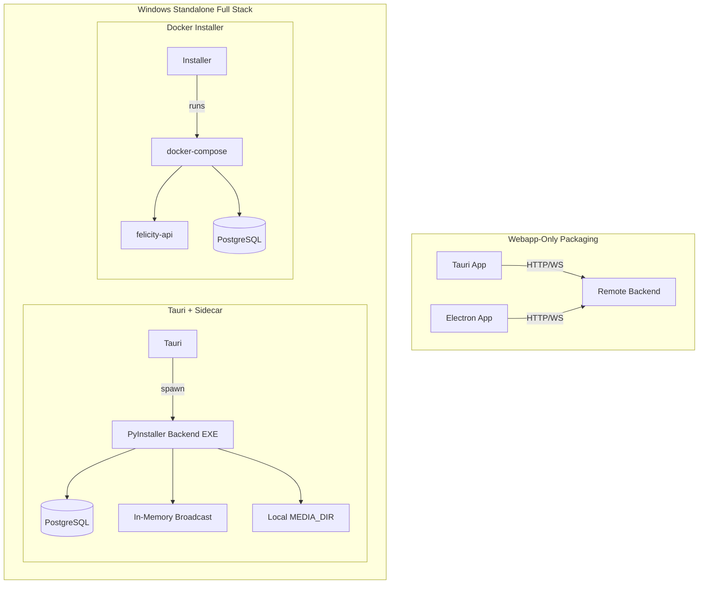

# Standalone Windows Packaging for Felicity LIMS

## Summary

| Approach                                | Feasibility | Complexity | Notes                                                              |
| --------------------------------------- | ----------- | ---------- | ------------------------------------------------------------------ |
| **Webapp only** (Tauri or Electron)     | High        | Low        | Connects to remote or locally-running backend                      |
| **Webapp + Backend** (single installer) | High        | Medium     | Only PostgreSQL required; Redis/MongoDB/MinIO optional (see below) |

### Windows Backend Configuration (Lightweight Mode)

Per `felicity/core/config.py`, when `REDIS_SERVER`, `MONGODB_SERVER`, and `MINIO_SERVER` are **not** specified:

- **Redis**: Uses in-memory `FelicityBroadcast` (`felicity/apps/common/channel/__init__.py`) — no Redis needed
- **MongoDB**: `DOCUMENT_STORAGE` is false — audit logs and documents use PostgreSQL via `AuditLogService` (`felicity/apps/auditlog/events.py`)
- **MinIO**: `OBJECT_STORAGE` is false — files use local `MEDIA_DIR` (filesystem)

**Result**: A Windows standalone setup needs only **PostgreSQL** plus the Python backend.

---

## Option 1: Webapp-Only Standalone (Recommended First Step)

Package the Vue 3 + Vite webapp as a Windows desktop app. The app connects to a backend via `VITE_BASE_URL` (`webapp/conf.ts`).

### Tauri (Recommended)

- **Bundle size**: ~3-10 MB vs ~150 MB for Electron
- **Memory**: ~58% less than Electron
- **Tech fit**: Vite config compatible; Tauri has first-class Vite support
- **Requirements**: Rust toolchain, WebView2 (pre-installed on Windows 10/11)

**Key changes:**

- Add `src-tauri/` with Tauri v2 config
- Set `base: './'` in Vite for correct asset paths in production
- Configure `VITE_BASE_URL` at build time or runtime (e.g., `http://localhost:8000` for local backend)
- Build: `pnpm tauri build` produces `.msi` or `.exe` installer

### Electron

- **Bundle size**: ~150 MB (bundles Chromium)
- **Pros**: Mature ecosystem, no Rust, simpler setup
- **Cons**: Larger footprint, higher memory use

---

## Option 2: Webapp + Backend (Single Installer)

For Windows standalone, the backend only requires **PostgreSQL**. Redis, MongoDB, and MinIO are optional and used only in high-availability server setups. When omitted, Felicity uses:

- In-memory broadcast (no Redis)
- PostgreSQL for audit logs and documents (no MongoDB)
- Local `MEDIA_DIR` for files (no MinIO)

### 2A: Tauri + Sidecar (Recommended for Full Stack)

- Package the FastAPI backend with **PyInstaller** as a Windows `.exe`
- Bundle it as a Tauri **sidecar** and spawn it when the app starts
- **PostgreSQL**: Either bundle a portable PostgreSQL or run a one-time installer that installs PostgreSQL for the user

**Flow**: Tauri app starts → spawns backend sidecar → backend connects to localhost PostgreSQL → webapp loads and connects to `http://localhost:8000`

### 2B: Docker-Based Installer

- Build a Windows installer that installs/checks Docker Desktop, runs minimal `docker-compose` with PostgreSQL + API only, opens webapp at `http://localhost:8000`

### 2C: SQLite "Lite" Variant (Future Option)

A future variant could use SQLite instead of PostgreSQL for zero external DB setup, but would require schema and migration refactoring.

---

## Architecture Overview

---

## Recommended Implementation Order

1. **Phase 1**: Add Tauri for webapp-only packaging (DONE)
   - Run `pnpm tauri:dev` for development (starts Vite + Tauri window)
   - Run `pnpm tauri:build` for production (outputs to `src-tauri/target/release/bundle/`)
   - On Windows: produces `.msi` and `.exe` installer
   - On Linux: produces `.deb`, `.rpm`, `.AppImage`
   - Set `VITE_BASE_URL=http://localhost:8000` (or your backend URL) when building to connect to the API

2. **Phase 2**: Full-stack Windows installer (Tauri + Sidecar)
   - PyInstaller backend EXE with env: no `REDIS_SERVER`, `MONGODB_SERVER`, `MINIO_SERVER`
   - Bundle or install PostgreSQL (portable or user-installed)
   - Tauri spawns backend sidecar on startup; webapp connects to `http://localhost:8000`

---

## Considerations

- **WebView2**: Tauri needs WebView2 on Windows; it is included in Windows 10/11. For older Windows, users may need to install it.
- **Code signing**: For production, sign the Windows executable to avoid SmartScreen warnings.
- **HIPAA**: Standalone deployment must still meet HIPAA requirements (encryption, audit, access control).
